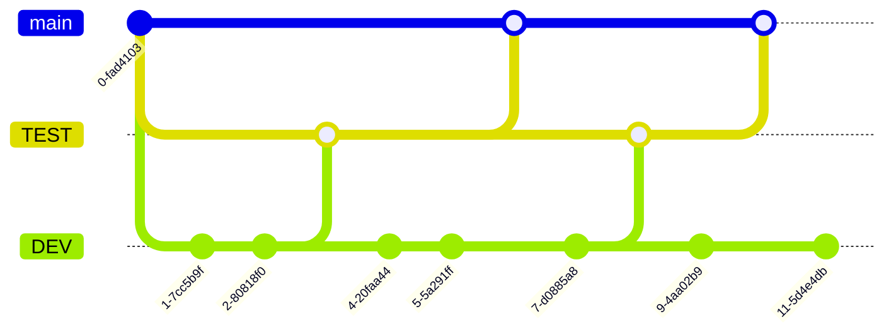

# Git Basics

Eine kurze Einführung in das Arbeiten mit Git.

- tl;dr
  - [Schnelleinstieg](#schnelleinstieg)
- [Git Basics](#git-basics)
  - [git init](#git-init)
  - [git add](#git-add)
  - [git commit](#git-commit)
  - [git push](#git-push)
  - [git pull](#git-pull)
- [Erweiterte Szenarien](#erweiterte-szenarien)
  - [git branch](#git-branch)
  - [git merge](#git-merge)

# tl;dr
Ihr habt alles schon einmal sorgsam durchgelesen und benötigt eine schnelle Referenz der Standardcommands?

## Schnelleinstieg
- Repository Klonen  
  `git clone <URL>`
- Neue oder **veränderte** Dateien dem Index hinzufügen  
  `git add <filename>`   oder  
  `git add .` (für alle Dateien)
- Änderungen in die Historie übernehmen  
  `git commit -m "<Nachricht als String>"`
- Lokales Repository ins GitHub pushen  
  `git push`

## Git Basics

### git init
Der Befehl `git init` erzeugt ein lokales Repository. Dieses Repository hat keine Verbindung zu GitHub, bietet aber dennoch alle Funktionen, die man für die (lokale) Versionisierung benötigt. 
Das eigentlich Repository wird über das ausgeblendete Verzeichnis `.git` verwaltet. In der Regel müsst ihr dieses Verzeichnis nicht verändern.  
`git init` erstellt außerdem einen Initialen [Branch](#Branch) mit dem Namen `main` (oder master, dann habt ihr meine Anleitung nicht sauber befolgt).

### git add
Der Befehl `git add <filename>` aktualisiert den sogenannten [Index](#Index).
Er fügt die angegebenen Dateien aus dem [working tree](#working-tree) (oder staging area) hinzu. Wir benötigen diesen Befehl, um im Nachgang unsere Änderungen [commit](#commit)en zu können.  >
Stellt euch das Ergebnis von `git add` wie einen neuen Snapshot unserer Dateien vor.

### git commit
`git commit -m "Mein neuer Commit"` erstellt einen neuen [Commit](#Commit) mit einer entsprechenden Nachricht. Dieser Commit ist ein direktes _Child_ unseres [HEAD](#head)-pointers. Der aktuelle Branch wird aktualisiert (ein neuer Eintrag in die Historie) und [HEAD](#head) zeigt auf den neuen Commit.  
Eine Ausnahme ist der sogenannte [Detached Head](#Detached-Head).

Hier eine Visualisierung zu diesem Prozess:

### git push
Das Remote Repository (idR. GitHub) mit lokalen Änderungen aktualisieren.
Lädt unsere Dateien aus der Staging-Area (git commit) hoch.
Das Remote Repository muss selbstverständlich existieren...  
Sofern das Repository zuvor mit `git clone` kopiert wurde, sollte alles funktionieren.
Ggf. kommt eine Fehlermeldung, die sich jedoch leicht beheben lässt.

Fehlermeldung:
 
Fehlerbehebung:
 

### git pull
Das lokale Repository mit den Daten aus dem Remote Repository aktualisieren.
Dies sollte (idR) immer der erste Befehl sein, den wir ausführen, bevor wir etwas an unseren Dateien verändern (Danke, Tobias!).

## Erweiterte Szenarien
(in Arbeit)

### git branch
### git merge

# Buzzwords

### Branch

### Index
Der Index ist in der Regel der aktive Branch. HEAD zeigt (meist) auf den Index.
### Working Tree
oder `Staging Area` ist ein Abbild des aktuellen Arbeitsverzeichnisses. Im Grunde also unser Branch nach einem `git add`.
### Commit
Das Hinzufügen unserer Änderungen zur Historie. Erstellen einer neuen Version (SHA hash) und verschieben des HEAD-Pointers auf den neuen hash.
### Detached Head
Erweitertes Szenario. Diese vermeintliche Fehlermeldung erscheint hauptsächlich, wenn ihr euch mit `git checkout` in eurer Historie bewegt. Beispielsweise, wenn ihr _in die Vergangenheit schauen_ wollt.

Sofern ihr in diesem Status keine Dateien verändert, könnt ihr das _Problem_ ganz einfach mit `git checkout main` lösen.
